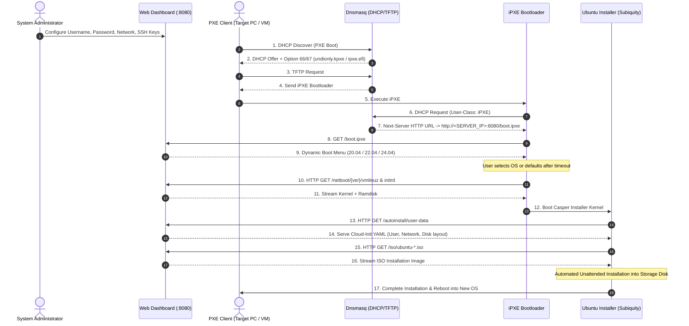

# 🚀 Ubuntu PXE Autoinstall Server

An all-in-one **PXE Boot & Autoinstall Server** for unattended, automated network installation of **Ubuntu 20.04 LTS, 22.04 LTS, and 24.04 LTS** using **Subiquity / Cloud-Init**, featuring a responsive **Web Configuration Dashboard** and fully containerized with **Docker**.

---

## ✨ Features

1. **Universal PXE Firmware Support**:
   - **Legacy BIOS (x86)**: Boots `undionly.kpxe`
   - **UEFI 64-bit (x86_64)**: Boots `ipxe.efi`
   - Automatically identified via DHCP Client Architecture matching (Option 93 / `client-arch`).
2. **iPXE Chaining & High-Speed HTTP Boot**:
   - iPXE dynamically loads the boot menu, Linux kernel (`vmlinuz`), and initial ramdisk (`initrd`) over HTTP, bypassing slow TFTP throughput.
3. **Responsive Web Dashboard**:
   - Configure **Administrator Username** and **Password** (passwords are automatically hashed to SHA-512 `$6$` for `/etc/shadow`).
   - Configure **Hostname**, **Real Name**, and **Timezone**.
   - Paste **SSH Authorized Public Keys** for passwordless logins.
   - Choose target network provisioning:
     - **Automatic DHCP**: Standard dynamic IP allocation.
     - **Static IP**: Pre-configure CIDR (`192.168.1.150/24`), Default Gateway, and DNS servers.
   - Add pre-installed APT packages (e.g., `curl`, `wget`, `git`, `htop`, `openssh-server`, `vim`, `docker.io`).
   - Inspect live previews of generated Subiquity `user-data` YAML and `boot.ipxe` scripts.
4. **Flexible DHCP Modes**:
   - **Full DHCP Server**: Leases IP addresses directly from a specified IP pool (ideal for isolated labs or subnets).
   - **ProxyDHCP Mode**: Coexists alongside an existing LAN router; responds only with PXE boot parameters without interfering with main DHCP allocations.
5. **Multi-Version Ubuntu Support**:
   - 🐧 Ubuntu 24.04 LTS (Noble Numbat)
   - 🐧 Ubuntu 22.04 LTS (Jammy Jellyfish)
   - 🐧 Ubuntu 20.04 LTS (Focal Fossa)

---

## 🏗️ Architecture & Boot Flow



---

## 📁 Repository Structure

```text
ubuntu-pxe-autoinstall/
├── Dockerfile                  # Multi-service container (Dnsmasq + FastAPI + Supervisor)
├── docker-compose.yml          # Compose specification for Linux (Host Networking)
├── docker-compose.win.yml      # Compose specification for Windows / Docker Desktop (Port Mapping)
├── supervisord.conf            # Supervisor daemon running Uvicorn and Dnsmasq
├── entrypoint.sh               # Container entrypoint configuring /etc/dnsmasq.conf dynamically
├── dnsmasq.conf.template       # Dnsmasq template for DHCP/TFTP and iPXE chaining
├── requirements.txt            # Python dependencies (FastAPI, Uvicorn, Jinja2, etc.)
├── download_assets.sh          # Asset downloader for Linux / macOS / WSL
├── download_assets.ps1         # Asset downloader for Windows PowerShell (Native Disk Mount)
├── app/
│   ├── main.py                 # FastAPI Application + iPXE Generator + Static Mounts
│   ├── autoinstall.py          # Subiquity YAML generator + Pure-Python SHA-512 Crypt
│   └── templates/
│       └── index.html          # Web Configuration Dashboard (Tailwind CSS Dark Theme)
├── data/                       # Persistent data directory mounted into Docker
│   ├── config.json             # Dashboard configuration state
│   ├── iso/                    # Ubuntu Live Server ISO storage
│   └── netboot/                # Extracted vmlinuz and initrd directories per version
│       ├── ubuntu-24.04/
│       ├── ubuntu-22.04/
│       └── ubuntu-20.04/
├── tftpboot/                   # Bootloader directory (undionly.kpxe, ipxe.efi)
└── tests/                      # Automated Unit Test Suite
    ├── test_autoinstall.py     # Subiquity YAML and password hashing tests
    └── test_api.py             # FastAPI route integration tests
```

---

## 🚀 Quickstart Guide

### Step 1: Download ISOs and Extract Kernels

Run the asset downloader to fetch desired Ubuntu Live Server ISOs and extract `casper/vmlinuz` and `casper/initrd`:

- **On Windows (PowerShell)**:
  ```powershell
  .\download_assets.ps1
  ```
- **On Linux / macOS / WSL**:
  ```bash
  bash download_assets.sh
  ```
*(Note: You can download only the specific versions you plan to install, e.g. Ubuntu 24.04).*

---

### Step 2: Launch Docker Container

Verify your host machine IP address (e.g., `192.168.1.100`), then launch the container:

**On Linux Host (Recommended for bare-metal PXE installs)**:
```bash
docker compose up -d --build
```
> **Note**: On Linux, `network_mode: host` is used to allow Dnsmasq to bind directly to host network interfaces and process Layer 2 broadcast DHCP Discover packets (`0.0.0.0:67` -> `255.255.255.255:68`).

**On Windows / Docker Desktop (For local VM testing)**:
```powershell
docker compose -f docker-compose.win.yml up -d --build
```

---

### Step 3: Access Web Configuration Dashboard

Navigate to the dashboard in your web browser:
👉 **`http://localhost:8080`** or **`http://<SERVER_IP>:8080`**

1. **PXE & DHCP Server**:
   - Set **Server IP** (the accessible IP of the machine running Docker).
   - Select **DHCP Mode**:
     - `Full DHCP`: Leases IP addresses directly.
     - `ProxyDHCP`: If an existing router manages DHCP on your subnet.
2. **Target System Credentials**:
   - Enter **Target Hostname**, **Username**, and **Password**.
   - Optionally paste an **SSH Authorized Public Key**.
3. **Network Addressing Mode**:
   - Choose `Automatic DHCP` or `Static IP`.
4. Click **💾 Save & Apply Configuration**.
5. Use **📄 Preview user-data** and **⚡ Preview boot.ipxe** to inspect generated files in real time.

---

## 🧪 Testing with Virtual Machines (VMs)

### VirtualBox:
1. Create a new VM (`Type: Linux`, `Version: Ubuntu (64-bit)`). Do not attach any ISO media.
2. Open **Settings -> System -> Motherboard**:
   - In **Boot Order**, enable **Network** and move it to the top.
   - For UEFI testing, check **Enable EFI (special OSes only)**.
3. Open **Settings -> Network**:
   - Set **Attached to** to **Bridged Adapter** (select your physical active network adapter).
4. Start the VM:
   - The VM sends a DHCP discover packet.
   - The blue iPXE menu appears displaying Ubuntu 24.04, 22.04, and 20.04 options.
   - The kernel and initrd are retrieved, Subiquity autoinstall runs unattended, and the machine reboots upon completion.

### VMware Workstation / ESXi:
1. Create a VM and configure the network adapter as **Bridged**.
2. Open VM settings -> Options -> Boot Options -> check **Power On to Firmware**.
3. In firmware, select boot from **Network (PXE)**.

### Proxmox VE:
1. Create a VM without CD/DVD drive.
2. In the Network tab, select bridge `vmbr0`.
3. In Options -> Boot Order, set the network device (`net0`) to priority 1.
4. Start the VM.

---

## 🔍 API Endpoints Reference

| Route | Method | Description |
|-------|--------|-------------|
| `/` | `GET` | Web Dashboard UI for managing settings and inspecting status |
| `/api/config` | `GET` / `POST` | Retrieve and update JSON configuration |
| `/api/status` | `GET` | Check availability and readiness of ISOs and netboot kernels |
| `/boot.ipxe` | `GET` | Dynamic iPXE boot script and menu for PXE clients |
| `/autoinstall/meta-data` | `GET` | Cloud-init instance metadata for Subiquity |
| `/autoinstall/user-data` | `GET` | Subiquity autoinstall YAML configuration (`#cloud-config`) |
| `/netboot/{ver}/...` | `GET` | Static file server streaming `vmlinuz` and `initrd` |
| `/iso/...` | `GET` | Static file server streaming Ubuntu Live Server ISO files |

---

## 🛠️ Automated Unit Testing

Run the test suite using `pytest`:

```bash
# Activate virtual environment if using one
.\.venv\Scripts\pytest.exe tests/ -v
# or on Linux
pytest tests/ -v
```

All tests verify:
- Drepper standard glibc SHA-512 crypt hashing (`$6$`).
- Subiquity autoinstall YAML structure in both DHCP and Static IP modes.
- FastAPI endpoint responses, status codes, and iPXE script integrity.
