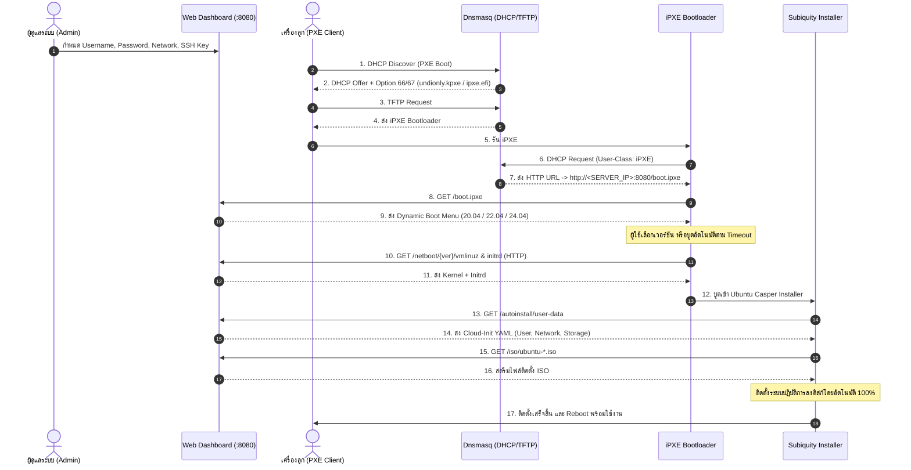

# 🚀 Ubuntu PXE Autoinstall Server

ระบบ **PXE Boot & Autoinstall Server** แบบครบวงจรสำหรับติดตั้ง **Ubuntu 20.04 LTS, 22.04 LTS และ 24.04 LTS** ผ่านระบบเครือข่ายอัตโนมัติ 100% โดยใช้ **Subiquity / Cloud-Init** พร้อมหน้า **Web Dashboard** เพื่อปรับแต่งการตั้งค่าได้อย่างง่ายดาย และรันด้วย **Docker**

---

## ✨ จุดเด่นและความสามารถ (Features)

1. **รองรับเครื่องลูกทุกสถาปัตยกรรม (Universal PXE Boot)**:
   - **Legacy BIOS (x86)**: ใช้ `undionly.kpxe`
   - **UEFI 64-bit (x86_64)**: ใช้ `ipxe.efi`
   - ตรวจจับอัตโนมัติผ่าน DHCP Option 93 (`client-arch`)
2. **iPXE Chaining & HTTP Boot**:
   - เมื่อเครื่องลูกโหลด iPXE แล้ว จะดึง Menu, Kernel และ Initrd ผ่าน HTTP ทันที เร็วกว่า TFTP ทั่วไปหลายเท่า
3. **Web Dashboard ปรับแต่งได้ตามต้องการ**:
   - ปรับแต่ง **Username**, **Password** (ระบบ Hash เป็น `$6$` SHA-512 สำหรับ `/etc/shadow` ให้อัตโนมัติ)
   - ปรับแต่ง **Hostname**, **Real Name**, **Timezone**
   - รองรับ **SSH Public Key** สำหรับเข้าระบบแบบไม่ต้องใส่รหัสผ่าน
   - เลือกระบบเครือข่ายของเครื่องลูก:
     - **DHCP Mode**: รับ IP อัตโนมัติ
     - **Static IP Mode**: กำหนด IP/CIDR, Default Gateway และ DNS ถาวร
   - เลือกติดตั้งแพ็กเกจ APT เริ่มต้น (เช่น `curl`, `wget`, `git`, `htop`, `openssh-server`, `vim`, `docker.io`)
   - ดูตัวอย่างไฟล์ Subiquity `user-data` และ `boot.ipxe` แบบสดๆ ผ่านหน้าเว็บ
4. **โหมด DHCP ยืดหยุ่น**:
   - **Full DHCP Server**: แจก IP ภายในวงเอง (สำหรับวงแล็บหรือระบบแยก)
   - **ProxyDHCP Mode**: กรณีมี Router เดิมแจก IP อยู่แล้วในเครือข่าย Dnsmasq จะไม่แย่งแจก IP แต่จะส่งเฉพาะข้อมูล PXE Boot ให้เครื่องลูก
5. **รองรับ Ubuntu 3 เวอร์ชัน LTS**:
   - 🐧 Ubuntu 24.04 LTS (Noble Numbat)
   - 🐧 Ubuntu 22.04 LTS (Jammy Jellyfish)
   - 🐧 Ubuntu 20.04 LTS (Focal Fossa)

---

## 🏗️ สถาปัตยกรรมการทำงาน (Architecture)



---

## 📁 โครงสร้างโปรเจกต์ (Project Structure)

```text
ubuntu-pxe-autoinstall/
├── Dockerfile                  # All-in-One Container (Dnsmasq + Python FastAPI + Supervisor)
├── docker-compose.yml          # Compose file สำหรับ Linux (Host Networking)
├── docker-compose.win.yml      # Compose file สำหรับ Windows / Docker Desktop (Port Mapping)
├── supervisord.conf            # จัดการ Process ให้ Uvicorn และ Dnsmasq ทำงานพร้อมกัน
├── entrypoint.sh               # สคริปต์ตรวจเช็ค Config และสร้าง /etc/dnsmasq.conf อัตโนมัติ
├── dnsmasq.conf.template       # เทมเพลตสำหรับ Dnsmasq (DHCP/TFTP/iPXE)
├── requirements.txt            # Python dependencies (FastAPI, Uvicorn, Jinja2, etc.)
├── download_assets.sh          # สคริปต์ดาวน์โหลด ISO & แตก Kernel สำหรับ Linux / Mac / WSL
├── download_assets.ps1         # สคริปต์ดาวน์โหลด ISO & แตก Kernel สำหรับ Windows PowerShell
├── app/
│   ├── main.py                 # FastAPI Application + iPXE Generator + ISO/Netboot Static Mount
│   ├── autoinstall.py          # ตัวสร้าง Subiquity user-data YAML + Pure SHA-512 Hash
│   └── templates/
│       └── index.html          # Web Dashboard UI (Tailwind CSS Dark Theme)
├── data/                       # โฟลเดอร์เก็บข้อมูล Persistent (Mount ใน Docker)
│   ├── config.json             # ไฟล์บันทึกการตั้งค่าจากหน้าเว็บ
│   ├── iso/                    # ที่เก็บไฟล์ Ubuntu Live Server ISO
│   └── netboot/                # ที่เก็บไฟล์ vmlinuz และ initrd แยกตามเวอร์ชัน
│       ├── ubuntu-24.04/
│       ├── ubuntu-22.04/
│       └── ubuntu-20.04/
├── tftpboot/                   # ที่เก็บไฟล์ undionly.kpxe และ ipxe.efi
└── tests/                      # Automated Unit Tests
    ├── test_autoinstall.py     # ทดสอบการแปลงรหัสผ่านและการสร้าง YAML
    └── test_api.py             # ทดสอบ FastAPI Endpoints ทั้งหมด
```

---

## 🚀 วิธีการติดตั้งและเริ่มต้นใช้งาน (Quickstart)

### ขั้นตอนที่ 1: เตรียมไฟล์ ISO และ Kernel

รันสคริปต์เพื่อดาวน์โหลด Ubuntu ISO ที่ต้องการ และแตกไฟล์ `vmlinuz` / `initrd` เตรียมไว้:

- **บน Linux / macOS / WSL**:
  ```bash
  bash download_assets.sh
  ```
- **บน Windows (PowerShell)**:
  ```powershell
  .\download_assets.ps1
  ```
*(หากต้องการทดสอบเพียงบางเวอร์ชันก่อน เช่น 24.04 สามารถดาวน์โหลดเฉพาะไฟล์ของเวอร์ชันนั้นได้)*

---

### ขั้นตอนที่ 2: เริ่มการทำงานผ่าน Docker

1. ตรวจสอบ IP Address ของเครื่องโฮสต์ของคุณ (เช่น `192.168.1.100`)
2. เริ่มการทำงานของ Docker Container:

**บน Linux Server (แนะนำสำหรับการใช้งานจริงบน Bare-metal)**:
```bash
docker compose up -d --build
```
> **หมายเหตุสำคัญ**: บน Linux ระบบใช้ `network_mode: host` เพื่อให้ Dnsmasq สามารถรับส่งแพ็กเกจ Layer 2 Broadcast ของ DHCP Discover ได้อย่างสมบูรณ์

**บน Windows / Docker Desktop (สำหรับการทดสอบในเครื่อง)**:
```powershell
docker compose -f docker-compose.win.yml up -d --build
```

---

### ขั้นตอนที่ 3: ตั้งค่าผ่าน Web Dashboard

เปิดเบราว์เซอร์แล้วไปที่:
👉 **`http://localhost:8080`** หรือ **`http://<SERVER_IP>:8080`**

1. **ตั้งค่า Server & DHCP**:
   - ใส่ **Server IP** (IP ของเครื่องแม่ข่ายที่เปิดให้เครื่องลูกเข้าถึงได้)
   - เลือก **DHCP Mode**:
     - `Full DHCP`: แจก IP เอง
     - `ProxyDHCP`: หากมีเราเตอร์หลักอยู่แล้ว
2. **กำหนดข้อมูลเข้าใช้งาน (Target Credentials)**:
   - ตั้งชื่อเครื่อง (**Hostname**), **Username**, และ **Password**
   - ใส่ **SSH Public Key** (ถ้ามี)
3. **เลือกระบบเครือข่ายของเครื่องลูก**:
   - `DHCP` หรือ `Static IP`
4. กดปุ่ม **💾 บันทึกการตั้งค่า (Save & Apply)**
5. สามารถกดปุ่ม **📄 ดูตัวอย่าง user-data** หรือ **⚡ ดูตัวอย่าง boot.ipxe** เพื่อตรวจสอบไฟล์ล่วงหน้าได้ทันที

---

## 🧪 การทดสอบ Boot ผ่าน Virtual Machine (VM)

### 1. ทดสอบด้วย VirtualBox:
1. สร้าง VM ใหม่ (เลือก Type: `Linux`, Version: `Ubuntu (64-bit)`) ไม่ต้องใส่แผ่น CD/ISO
2. ไปที่ **Settings -> System -> Motherboard**:
   - ในช่อง **Boot Order** ให้ติ๊กเลือก **Network** และเลื่อนขึ้นมาไว้บนสุด
   - หากต้องการทดสอบ UEFI ให้ติ๊กที่ **Enable EFI (special OSes only)**
3. ไปที่ **Settings -> Network**:
   - เปลี่ยน **Attached to** เป็น **Bridged Adapter** (เลือกการ์ดแลนวงเดียวกับเครื่องโฮสต์)
   - หรือเลือก **Host-only Adapter** (หากทดสอบภายในเครื่อง)
4. เปิดเครื่อง VM:
   - เครื่องจะส่ง DHCP Discover ขอรับ IP
   - ปรากฏหน้าจอสีฟ้า **Ubuntu Netboot PXE Autoinstall Server**
   - เลือกรุ่น Ubuntu 24.04, 22.04 หรือ 20.04
   - ระบบจะดาวน์โหลด Kernel และเริ่มติดตั้งให้อัตโนมัติจนเสร็จสิ้น 100%!

### 2. ทดสอบด้วย VMware Workstation / ESXi:
1. สร้าง VM ใหม่ และตั้งค่า Network Adapter เป็น **Bridged**
2. ในการตั้งค่า Boot Options เลือก **Power On to Firmware**
3. เลือก Boot จาก **Network (PXE)**

### 3. ทดสอบด้วย Proxmox VE:
1. สร้าง VM ใหม่ ไม่ต้องเลือก ISO
2. ในแถบ Network เลือก Bridge `vmbr0`
3. ในแถบ Options ปรับ Boot Order ให้การ์ด Network ขึ้นอันดับ 1
4. สั่ง Start VM

---

## 🔍 API Endpoints ที่สำคัญ

| Path | Method | คำอธิบาย |
|------|--------|----------|
| `/` | `GET` | หน้าเว็บ Dashboard สำหรับปรับแต่งการตั้งค่า |
| `/api/config` | `GET` / `POST` | ดูและอัปเดตข้อมูลการตั้งค่า (JSON) |
| `/api/status` | `GET` | ตรวจสอบสถานะความพร้อมของ ISO และ Kernel ในแต่ละเวอร์ชัน |
| `/boot.ipxe` | `GET` | ไฟล์สคริปต์เมนูของ iPXE สำหรับเครื่องลูก |
| `/autoinstall/meta-data` | `GET` | ข้อมูล Instance Metadata สำหรับ Subiquity |
| `/autoinstall/user-data` | `GET` | ไฟล์ `#cloud-config` สำหรับติดตั้งอัตโนมัติ |
| `/netboot/{ver}/...` | `GET` | ดาวน์โหลด Kernel `vmlinuz` และ `initrd` |
| `/iso/...` | `GET` | ให้บริการสตรีมไฟล์ `.iso` สำหรับ Subiquity |

---

## 🛠️ การรัน Unit Tests (Local Testing)

```bash
# รันการทดสอบ Unit Tests
python -m pytest tests/ -v
```
